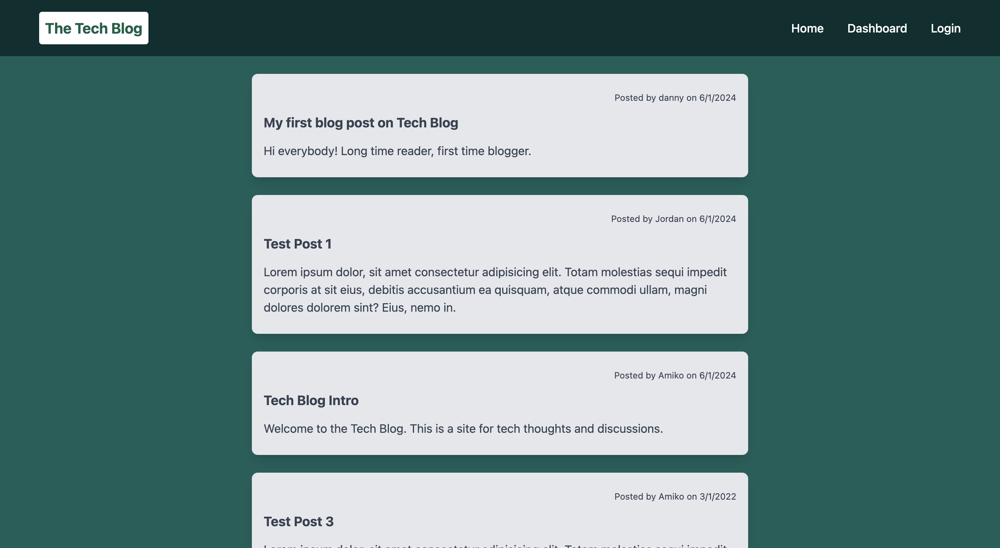
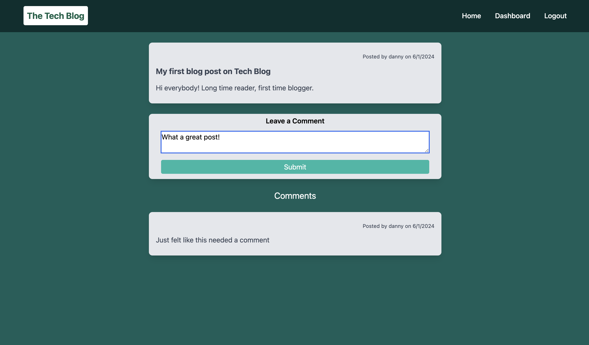
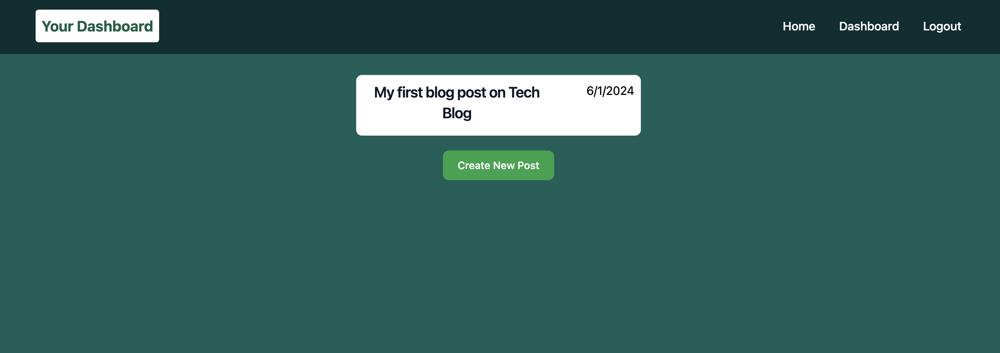
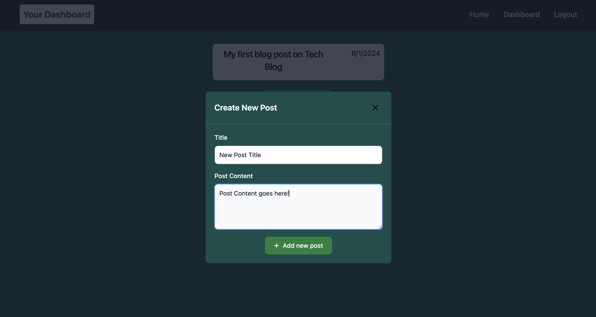
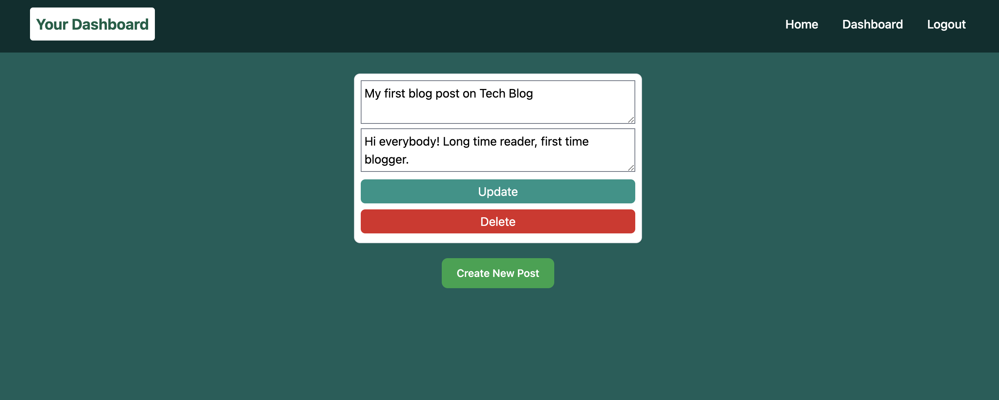

# Tech Blog

##### Table of Contents

 [Description](#description)  
 [Installation](#installation)  
 [Usage](#usage)   
 [Deployed Site](#deployed-site)   
 [Contributions](#contributions)  
 [Questions](#questions)  


## Description
Tech Blog is a content management system-style blog site that allows users to create, manage, and interact with blog posts. This application offers a seamless experience for users to browse existing blog posts, sign up, log in, and manage their own content. This application utilizes the Model-View-Controller paradigm using MySQL, Handlebars, and Express.


## Installation
### Clone the repository:
```
git clone https://github.com/dgomie/tech-blog.git
```
### Navigate to the project directory:
```
cd tech-blog
```

### Install the required dependencies:
```
npm install
```

### Set up the MySQL database:

Create a database named blog_db.
Import the provided SQL file to set up the initial database schema:
```
mysql -u yourusername -p blog_db < db/schema.sql;
```


### Set up environment variables:

Create a .env file in the root directory and add the following:
```
DB_USER=your_db_username
DB_PASSWORD=your_db_password
DB_NAME=blog_db

```

### Optional:  
Seed database with placeholder data using
```
npm run seed
```

## Usage
Start the server:
```
npm start
```

Open your web browser to http://localhost:3001

### Homepage


First Visit: Upon visiting the site for the first time, users are presented with the homepage. This includes existing blog posts (if any have been posted), navigation links for the homepage and the dashboard, and an option to log in.

Navigation: Clicking on the homepage option in the navigation bar takes users back to the homepage.

Authentication
Sign Up: Users can sign up by creating a username and password. Upon clicking the sign-up button, the credentials are saved, and users are logged into the site.

Sign In: Returning users can sign in by entering their username and password. Successful login grants access to additional navigation options.

Session Management: If a user is idle for a set period, they can still view posts and comments but must log in again to add, update, or delete content.

### User Experience
Navigation Links: When signed in, users see navigation links for the homepage, dashboard, and the option to log out.

Logout: Clicking the logout option signs the user out of the site.

### Blog Posts
 

Viewing Posts: On the homepage, existing blog posts display the post title and the date created. Clicking on a post shows the post title, contents, creator's username, and date created, with an option to leave a comment.

Adding Comments: Signed-in users can enter comments on posts. Comments are saved and displayed with the comment creator’s username and date created.

### Dashboard


User Posts: The dashboard shows blog posts created by the signed-in user, with options to add, update, or delete posts.



Creating Posts: Users can add new blog posts by entering a title and content. New posts are saved and displayed on the updated dashboard.



Managing Posts: Users can click on their existing posts in the dashboard to update or delete them. Changes reflect immediately on the updated dashboard.


## Deployed Site
Deployed application can be found at:  
https://still-wildwood-68456-d44a68e622ba.herokuapp.com/

## Contributions
### Components and Design Resources

- Navbar: Implemented using components from [Flowbite Navbar](https://flowbite.com/docs/components/navbar/).

- Sign-in Forms: Utilized sign-in forms from [Tailwind UI](https://tailwindui.com/components/application-ui/forms/sign-in-forms).

- Registration Form: Created with blocks from [Flowbite Marketing Register](https://flowbite.com/blocks/marketing/register/).


## Questions

For any questions regarding the repository, contact me via:

- Github: [dgomie](https://www.github.com/dgomie)
- Email: <a href="mailto:danny.f.gomez@gmail.com">danny.f.gomez@gmail.com</a>
